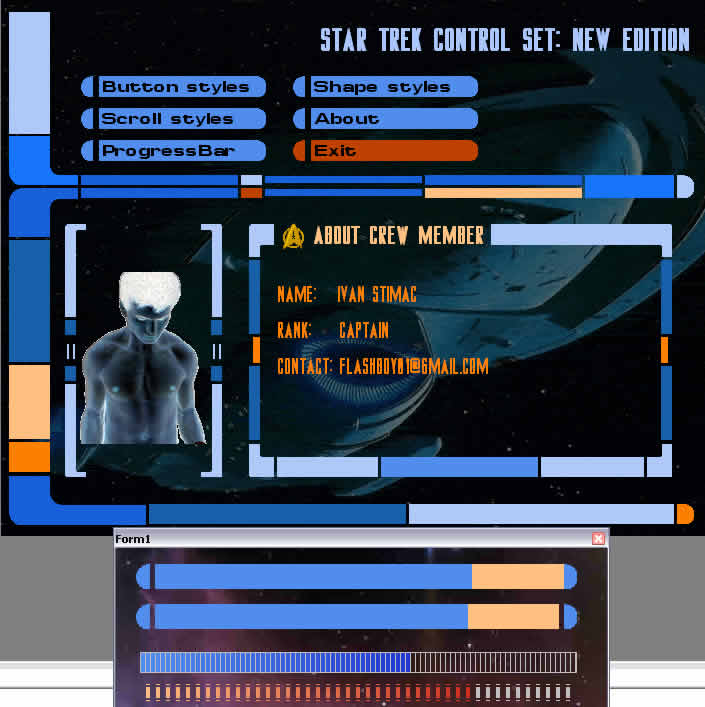



## a2\_Star Trek Controls Collection

### Description

I'm develop new ST controls collection. There is much styles and other propertyes to create custom trekkie controls. But you can create also project that isn't trekkie. Collection have button, label, shape, progressbar and scroll components. Button and label have 13 STYLES! There is several federation, klingon and romulan styles. All control have transparent color property so you can add background image to your project and use this controls.

This collection is also excelent example how to create controls without any other control (except timer). Scroll control also have only timer control.

I think this is the bigest free trekkie collection and you must check it. I have spend few days to develop them, so plese if you like it PLEASE DONT FORGET VOTE.
 
### More Info
 

             |
---                |---
**Submitted On**   |2006-08-01 15:49:30
**By**             |[ivan stimac](https://github.com/Planet-Source-Code/PSCIndex/blob/master/ByAuthor/ivan-stimac.md)
**Level**          |Intermediate
**User Rating**    |4.8 (63 globes from 13 users)
**Compatibility**  |VB 6\.0
**Category**       |[OLE/ COM/ DCOM/ Active\-X](https://github.com/Planet-Source-Code/PSCIndex/blob/master/ByCategory/ole-com-dcom-active-x__1-29.md)
**World**          |[Visual Basic](https://github.com/Planet-Source-Code/PSCIndex/blob/master/ByWorld/visual-basic.md)
**Archive File**   |[a2\_Star\_Tr201035812006\.zip](https://github.com/Planet-Source-Code/ivan-stimac-a2-star-trek-controls-collection__1-66159/archive/master.zip)

